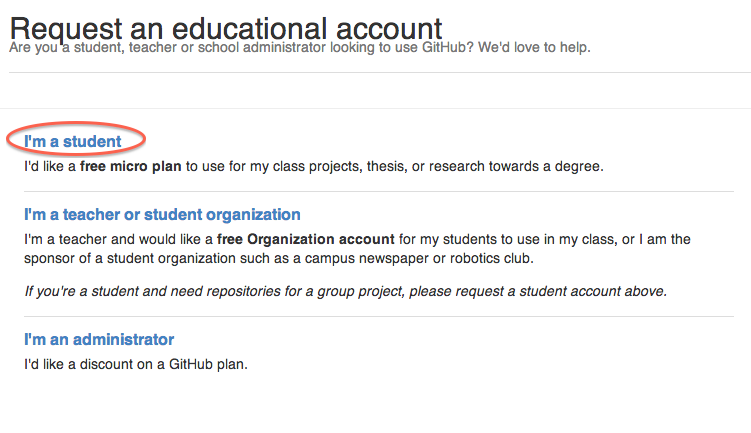
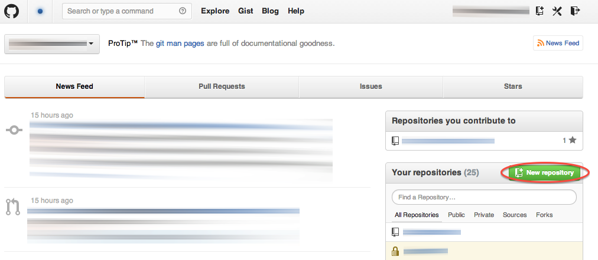
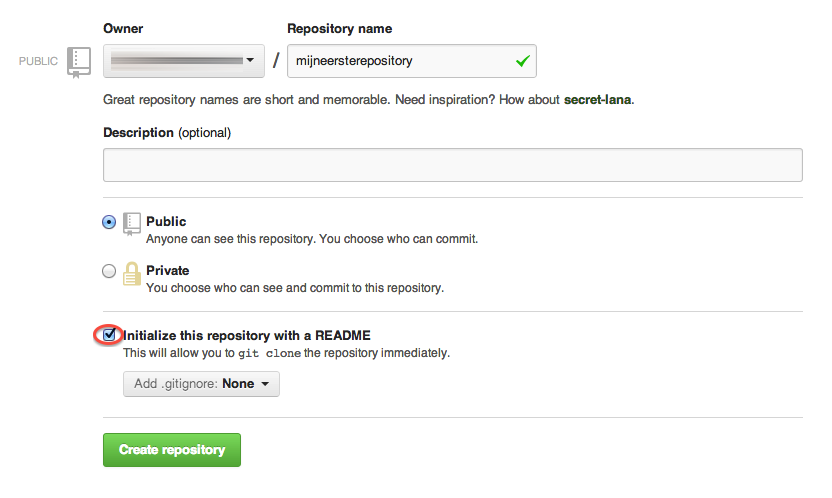
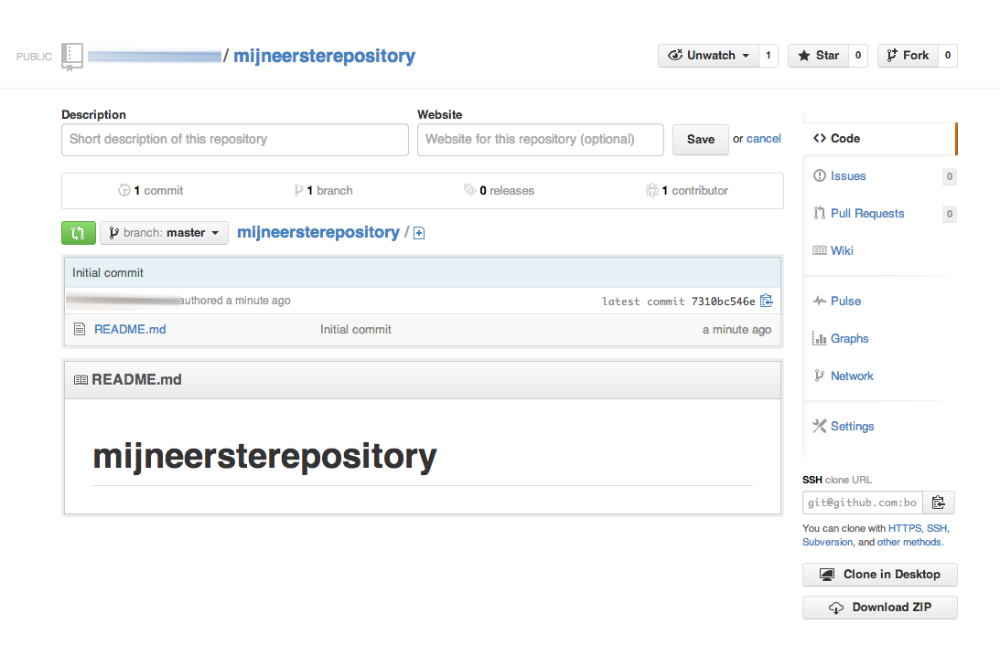

# GitHub
GitHub is een online platform om samen aan code te werken. GitHub is niet alleen gespecialiseerd in het hosten van code maar ook in het gemakkelijk laten samenwerken van teams aan code.
Het bedrijf bestaat sinds 2005 en heeft al vele miljoenen gebruikers die er dagelijks gebruik van maken. In deze handleiding wordt toegelicht hoe er een GitHub account kan worden aangevraagd en hoe studenten in aanraking kunnen komen voor een *Educational Discount*. Verder wordt er verwezen naar website waar git geleerd kan worden.

## Account aanvragen
Surf naar [GitHub.com](http://www.github.com) om een GitHub account aan te maken.
Om een *Educational Discount* te kunnen krijgen moet er een aanvraag worden ingediend bij GitHub.
Dit kan op de [deze](https://education.github.com/pack) pagina (hieronder afgebeeld).

Vul hier al de benodigde gegevens in en GitHub zal je aanvraag in behandeling nemen. Dit kan enige tijd duren en tot die tijd zul kunnen er alleen public repositories worden aangemaakt.

## Repository
Om van start te gaan met GitHub kun je een nieuwe *repository* aanmaken.
Klik hiervoor op **New repository** zoals hieronder afgebeeld:

Geef deze vervolgens een naam en vink **Initialize this repository with a README** aan en klik op **Create repository**, zie afbeelding hieronder:

**NB:** Indien het een betaald account is kan er ook een private repository worden aangemaakt.

Als alles succesvol voltooid is zal het volgende scherm zichtbaar worden:

## Github for
GitHub heeft een aantal applicaties ontwikkeld die het gemakkelijk moeten maken om te synchroniseren vanaf je lokale computer met de git repository op GitHub.
Hieronder staan de links naar de applicatie:

* [GitHub for Windows](http://windows.github.com/)
* [GitHub for Mac](http://mac.github.com/)

## Leer git
In het begin kan het soms wat lastig zijn met git. Om de basis vaardigheden van git onder de knie te krijgen in de commandline heeft GitHub een tutorial gemaakt die [hier](http://try.github.io/) te vinden is. 
Verder heeft CodeSchool ook een aantal geavanceerde git tutorials die erg aan te raden zijn. (Klik [hier](http://www.codeschool.com/paths/electives#git-basics) om naar CodeSchool te gaan)